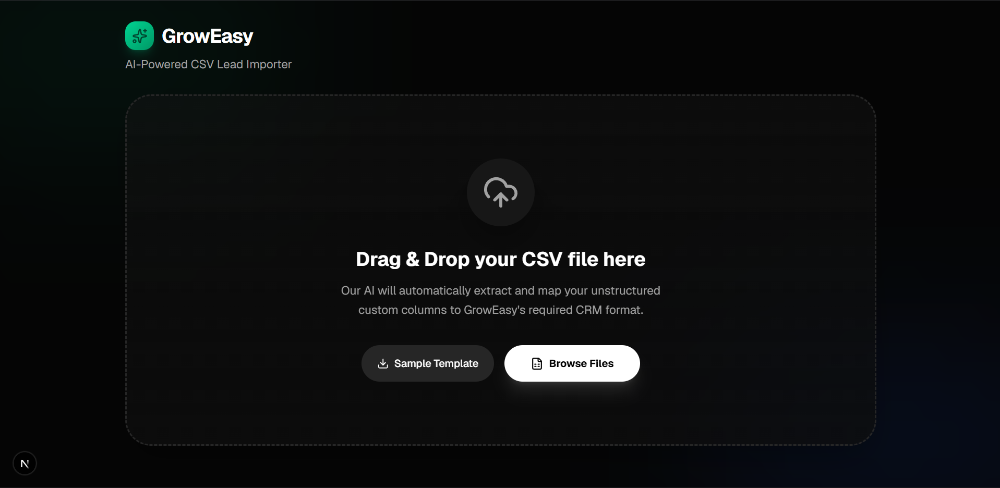
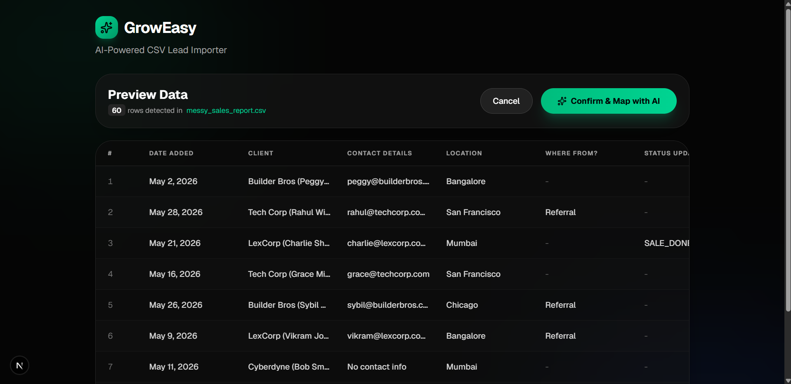
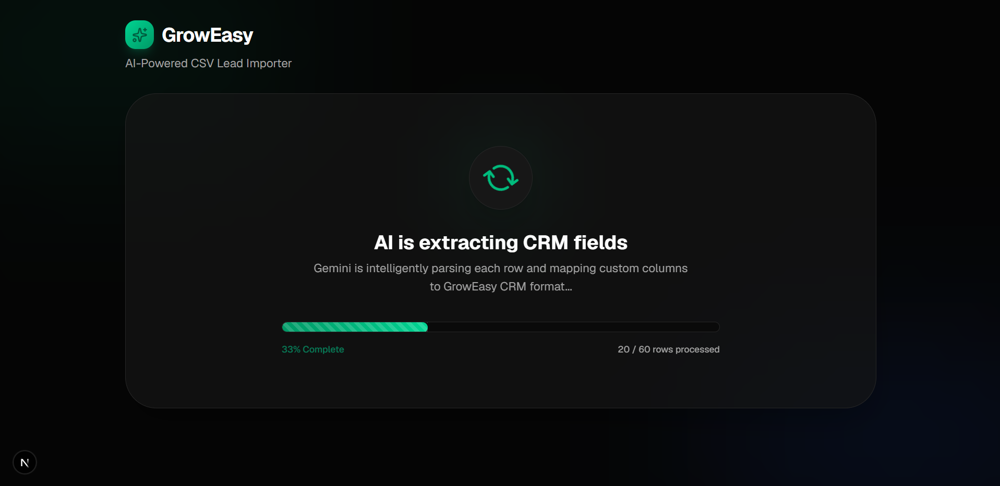
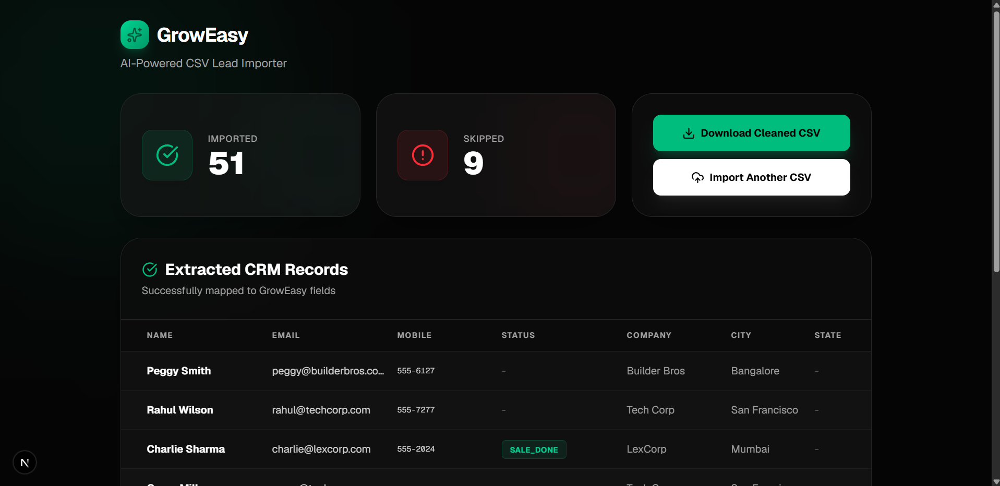
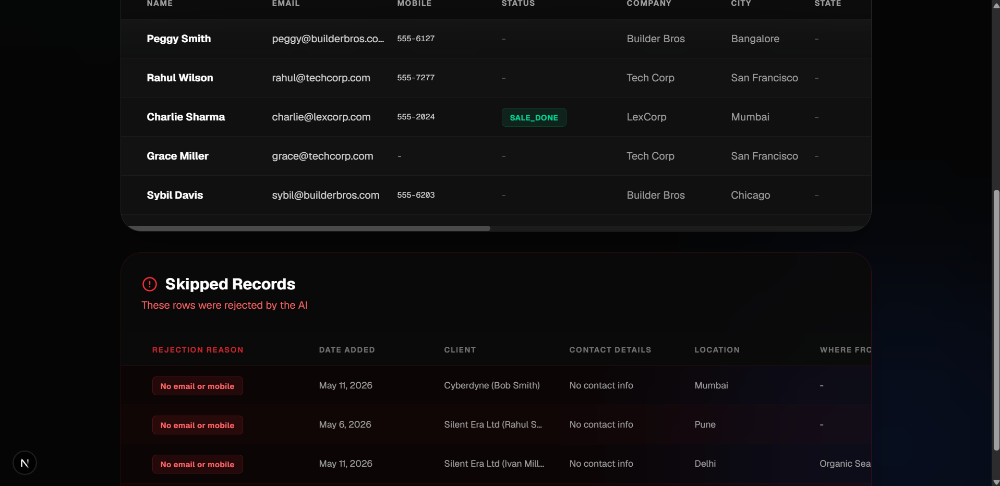

# GrowEasy AI-Powered CSV Lead Importer

This project intelligently extracts CRM lead information from any valid CSV format using Gemini AI. It automatically identifies appropriate fields from chaotic or custom CSV files (e.g. Facebook Leads, Real Estate CRMs) and maps them to standard CRM properties.

## Architecture

This project is separated into a Next.js frontend and an Express/Node.js backend:
- **`frontend/`**: Contains the Next.js React UI. It provides an intuitive drag-and-drop CSV uploader, a preview table, and a virtualized results viewer.
- **`backend/`**: Contains the Node.js Express API. It handles parsing the raw CSV in memory and communicating with the Gemini AI model in batches to normalize the CRM fields.

## Setup Instructions

### Prerequisites
- Node.js v22 or higher
- Gemini API Key

### Installation

1. Install dependencies for all parts of the project from the root folder:
   ```bash
   npm run install:all
   ```

2. Add your Gemini API key to the backend `.env` file:
   - Create `backend/.env` (if not already there) and add:
     ```env
     PORT=3001
     GEMINI_API_KEY=your_actual_api_key_here
     ```

### Running Locally

Run both the frontend and backend concurrently using the root script:
```bash
npm run dev
```

- **Frontend** runs on [http://localhost:3000](http://localhost:3000)
- **Backend API** runs on `http://localhost:3001`

### Running with Docker

You can use Docker Compose to spin up both services containerized:
```bash
docker-compose up --build
```
Ensure you provide `GEMINI_API_KEY` in the environment when using Docker.

## Features Included
- ✅ Complete separation of Frontend (Next.js) and Backend (Node.js/Express)
- ✅ Drag & Drop CSV upload
- ✅ Virtualized data tables to handle massive files smoothly
- ✅ Intelligent AI extraction mapping unstructured columns to 15 different CRM parameters
- ✅ Batch processing with built-in retry mechanisms and rate-limit handling for Gemini AI
- ✅ Progress indicators during AI processing
- ✅ Comprehensive Dark Mode UI using Tailwind CSS
- ✅ Docker configuration included
- ✅ Export extracted records directly to CSV
- ✅ Dedicated UI for skipped records explaining rejection reasons
- ✅ Comprehensive unit testing implemented for backend APIs

## Screenshots






